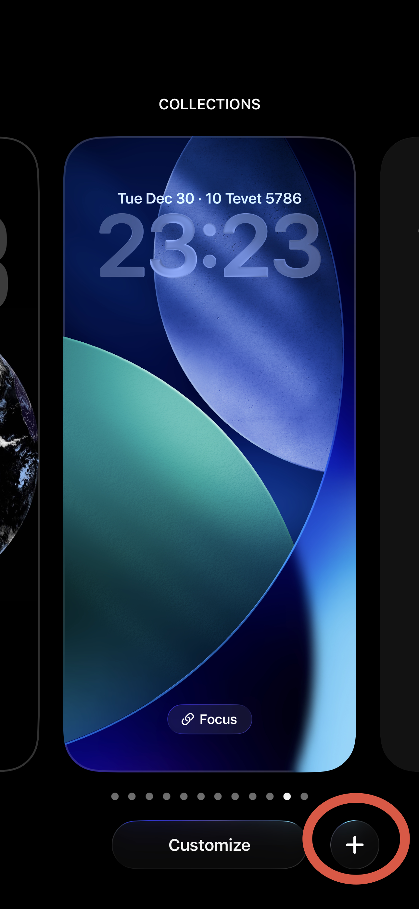
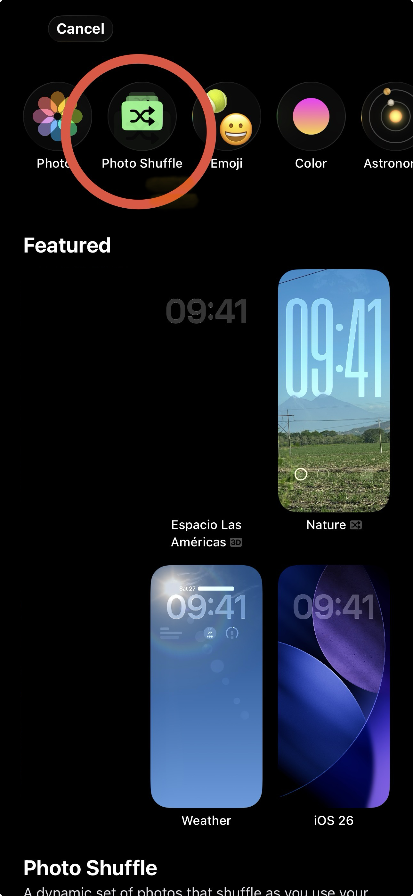
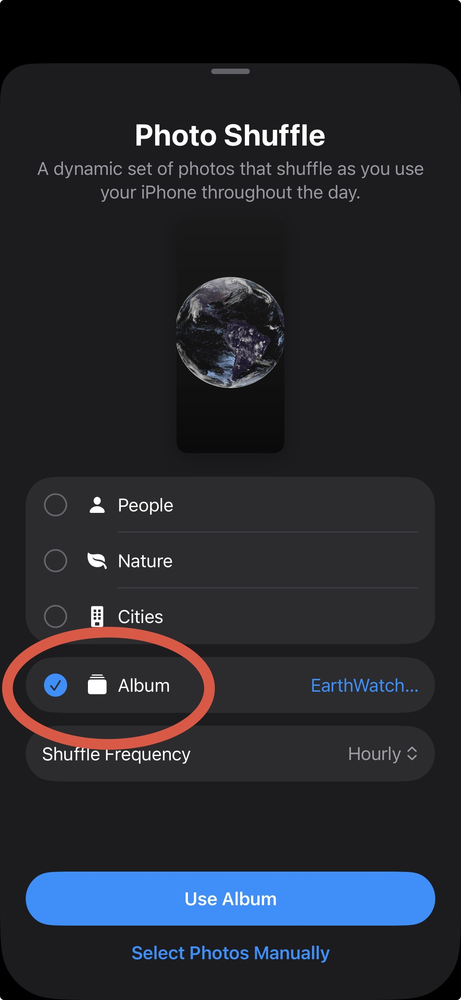
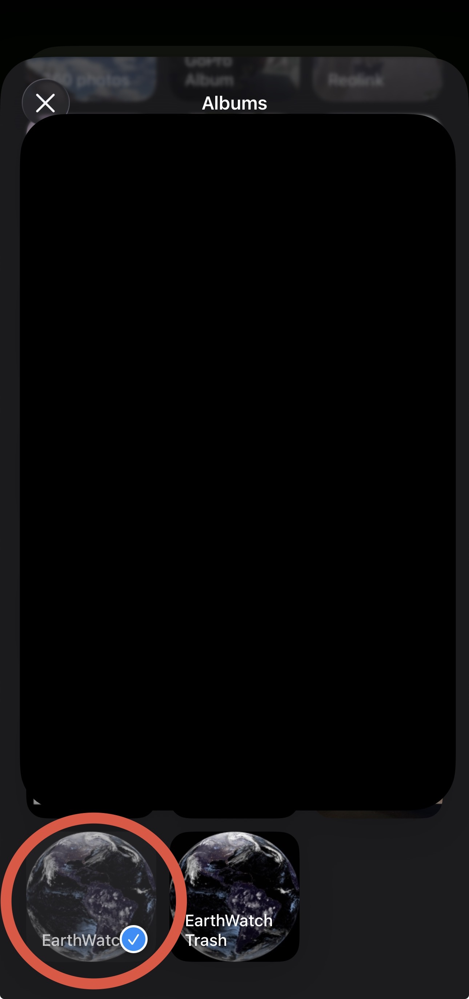
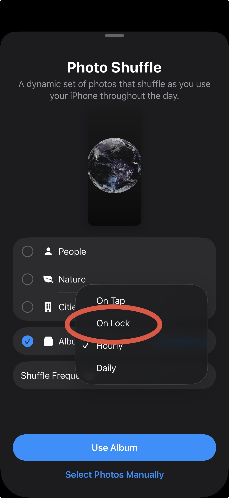
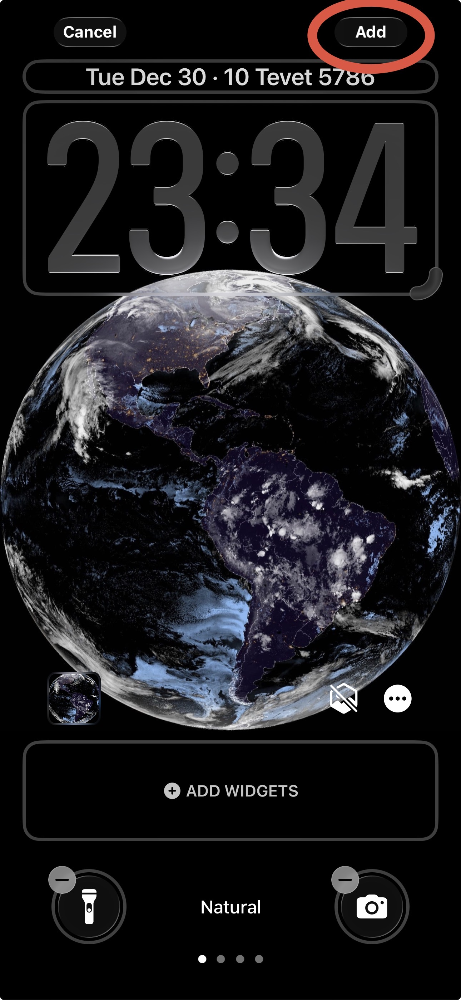
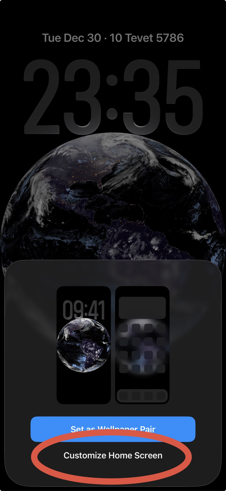
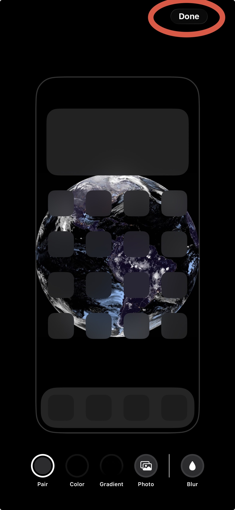
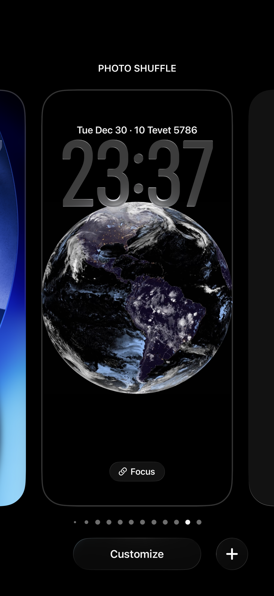

## Let's get started!

First, push the power button once to turn off and then again to turn back on.

When you see the lock screen, tap and hold until you see the Customize and + buttons appear at the bottom.

Click the **+** button.

At the top, choose **Photo Shuffle**.

Select **Album** and choose the **EarthWatch** Album (it may be at the very bottom of the list of albums).

For Shuffle Frequency, choose **On Lock**, then click **Use Album**.

You should now see one of our satellite images on the screen.

Next, choose **Add** in the top right.

When asked if you would like to set as a wallpaper pair, choose **Customize Home Screen**.

Click the **Blur** droplet in the bottom right corner, and then **Done** in the top right.

Lastly, click the lock screen layout show in the screen, and you're all set!

As new images of Earth are made available, EarthWatch will automatically download them and update your iPhone screen background in, well, the background!
